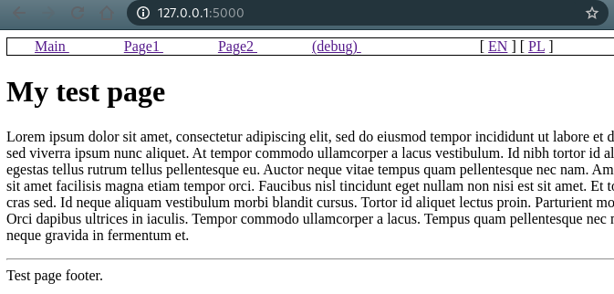

# JSekyll - minimalistic Static Site Generator in JavaScript

Contact: Robert Nowotniak <<rnowotniak@gmail.com>>

**I have abandoned this project, and I've decided to move to a different SSG**

This tool is a minimalistic Static Site Generator inspired by [Jekyll](https://jekyllrb.com/).
Thanks to its simplicity it allows to keep all processing under your control.
However, only a subset of Jekyll features is supported. Neither it is 100% compatible with original Jekyll.

## Implemented features

* Two run modes: build / serve
* Serving site locally in dev mode ([Express](https://expressjs.com/) JavaScript lib)
* MarkDown support with ([Marked JS](https://marked.js.org/) lib)
* Liquid templates support ([LiquidJS](https://liquidjs.com/))
* Live Reload ([browser-sync](https://browsersync.io/))
* Load data from _data/*.yml
* Process files selectively
* Multi-language support
* Page variables:   {{ page.var }}
* _layouts/ directory
* _includes/ directory
* _config.yml configuration file (to liquid vars  site.var)
* Multi-files support
* Frontmatter support

## Example site

### Build

    $ ./jsekyll.js -s tests/testpage1/ build 

    building site tests/testpage1/ -> ./_site
    Loading _config.yml and _data/*.yml
    {
      permalink: '/:categories/:year/:title/',
      title: 'My test website',
      email: 'address@example.org',
      layout: 'layout1',
      defaults: [
        { scope: [Object], values: [Object] },
        { scope: [Object], values: [Object] }
      ],
      highlighter: 'none',
      kramdown: {
        input: 'GFM',
        highlighter: false,
        syntax_highlighter: false,
        syntax_highlighter_opts: { disable: true }
      }
    }
    ---
    -> Processing page2.md
    Yaml: { title: 'Page 2', permalink: '/page2/' }
    Writing ./_site//page2//index.html
    -> Processing debug.md
    Yaml: { title: 'debug' }
    Writing ./_site/debug/index.html
    -> Processing index.html
    Yaml: { myval: 5, title: 'My test page' }
    html file
    Writing ./_site/index.html
    -> Processing page1.md
    Yaml: { title: 'Page 1', permalink: '/page1/' }
    Writing ./_site//page1//index.html
    -> Processing index-pl.html
    Yaml: { title: 'My website - Polish version', permalink: '/pl/' }
    Writing ./_site//pl//index.html

### Serve and test

    $ ./jsekyll.js s -P 5000
    serving site

## TODO perhaps some day in the future
* themes
* plugins

## Not supported and not planned
Simply because I was never using these in Jekyll:
* SCSS

## References

* https://jekyllrb.com/  -  Jekyll SSG, which inspired this work
* https://nextjs.org/  - another SSG in JavaScript (React SSG)
* https://css-tricks.com/building-a-blog-with-next-js/ (Next.js tutorial)
